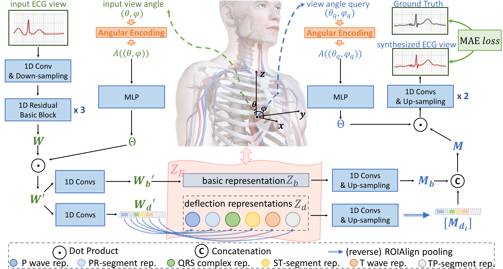
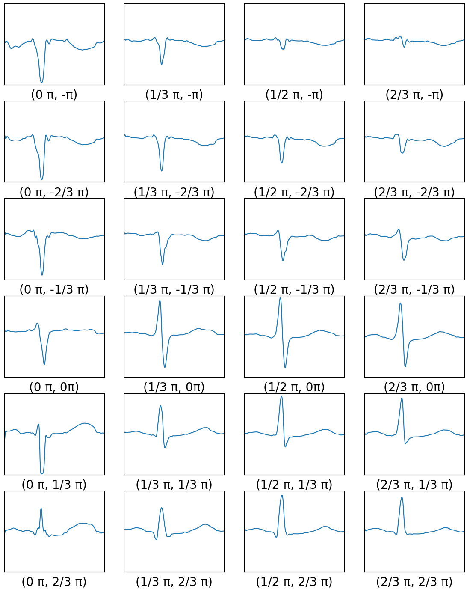
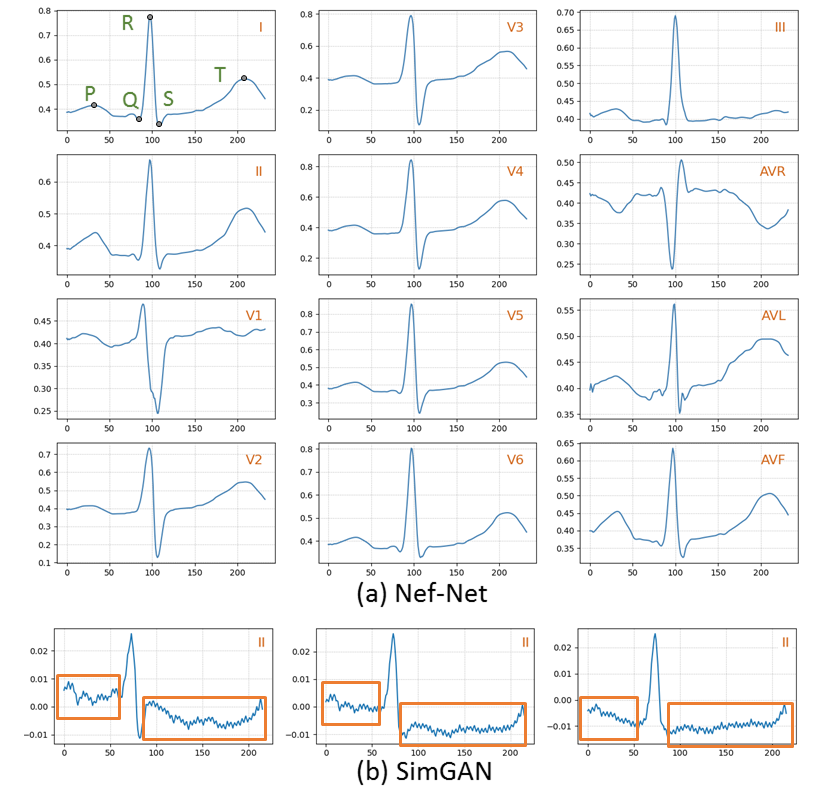

# Electrocardio Panorama

This repository contains the code and datasets for our IJCAI 2021 paper [*Electrocardio Panorama: Synthesizing New ECG views with Self-supervision*](https://arxiv.org/pdf/2105.06293.pdf).

We present a new concept called **Electrocardio Panorama**, which allows doctors to observe the ECG signals from any viewpoints and only requires one or few ECG views as input. To synthesize Electrocardio Panorama, we propose a model called Nef-Net.

## Nef-Net framework illustration

## Abstract information
Multi-lead electrocardiogram (ECG) provides clinical information of heartbeats from several fixed viewpoints determined by the lead positioning. However, it is often not satisfactory to visualize ECG signals in these fixed and limited views, as some clinically useful information is represented only from a few specific ECG viewpoints. For the first time, we propose a new concept, Electrocardio Panorama, which allows visualizing ECG signals from any queried viewpoints. To build Electrocardio Panorama, we assume that an underlying electrocardio field exists, representing locations, magnitudes, and directions of ECG signals. We present a **N**eural **e**lectrocardio **f**ield **Net**work (Nef-Net), which first predicts the electrocardio field representation by using a sparse set of one or few input ECG views and then synthesizes Electrocardio Panorama based on the predicted representations. Specially, to better disentangle electrocardio field information from viewpoint biases, a new *Angular Encoding* is proposed to process viewpoint angles. Also, we propose a self-supervised learning approach called *Standin Learning*, which helps model the electrocardio field without direct supervision. Further, with very few modifications, Nef-Net can synthesize ECG signals from scratch. Experiments verify that our Nef-Net performs well on Electrocardio Panorama synthesis, and outperforms the previous work on the auxiliary tasks (ECG view transformation and ECG synthesis from scratch).

## Illustration
### An example illustrating 24 views of an Electrocardio Panorama:

**Please note that an Electrocardio Panorama actually has continuous unlimited views.**

### An example on ECG data synthesis from scratch

**ECG data from sratch synthesis is just a supplementary function of our Nef-Net, but is obviously better than the previous GAN work for ECG data (e.g., SimGAN). It is suggested that the underlying ECG information is well captured by the Nef-Net model.**

## How to use?
* Prepare your env following requirements.txt

     `pip install requirements.txt`

* train Nef-Net by

    `python -u main.py --config-file config/nef-net.yml`

## Citation

**The code is just for reference. Our work is only the first step to explore the Electrocardio Panorama, and we are really looking forward to future work analysing or synthesizing Electrocardio Panorama.**

Also, we provide some segmentation labels on [Tianchi ECG dataset](https://tianchi.aliyun.com/competition/entrance/231754/information) and [PTB Diagnostic ECG dataset](https://www.physionet.org/content/ptbdb/1.0.0/). You can use the labels in researches on Electrocardio Panorama and other ECG academic researches. We also provide an ECG segment annotation tool. **Commercial purposes are not allowed.** As for the original ECG data and labels, please use them following their policy.

Please cite the paper if the codes, ECG annotation tools or the dataset labels we provided are helpful:

    @inproceedings{chen2021Electrocardio,
        author = {Chen, Jintai and Zheng, Xiangshang, and Yu, Hongyun and Chen, Danny Z and Wu, Jian},
        title = {{Electrocardio Panorama: Synthesizing New ECG views with Self-supervision}},
        booktitle = {IJCAI},
        year = {2021}
    }
